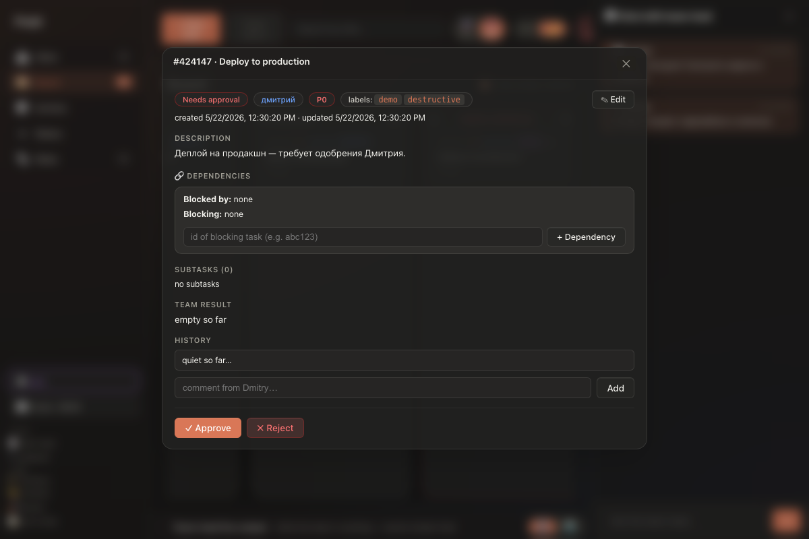
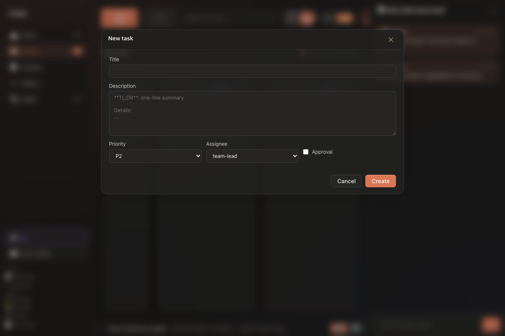
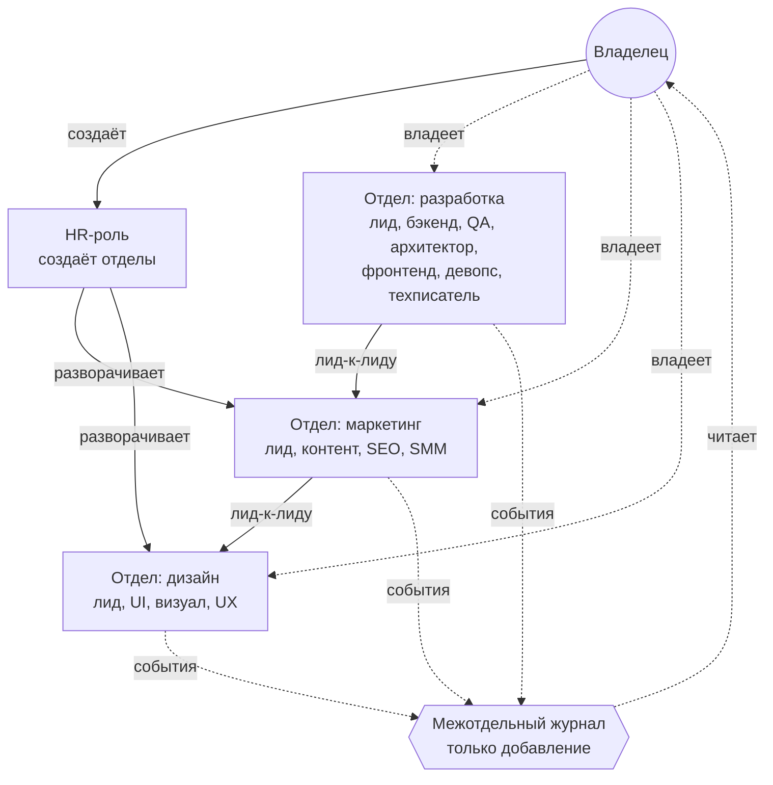

# devboard

**ИИ-команда разработки в твоём канбане.**

Семь ролей-ботов — тимлид, бэкенд, QA, архитектор, фронтенд, девопс,
техписатель — работают на одной локальной доске и выпускают настоящий код,
пока ты смотришь на канбан. Ты пишешь задачу; тимлид берёт её, раскладывает
на подзадачи, раздаёт специалистам, проверяет результат — и возвращает тебе
на приёмку. К тебе команда приходит только тогда, когда это действительно
нужно: рискованные операции проходят через ворота одобрения.

> **Честно о проекте.** Это рабочий личный инструмент автора, опубликован
> как есть под MIT. Метод «человек ставит задачи и принимает результат,
> ИИ-роли исполняют» отработан здесь и применяется автором во всех его
> следующих системах.

## Быстрый старт

```bash
git clone https://github.com/rdm9x/devboard.git
cd devboard
cp .env.example .env
# в .env вписать ANTHROPIC_API_KEY
docker compose up
# открыть http://localhost:4999
```

Одинаково работает на Windows / macOS / Linux, нужен
[Docker Desktop](https://www.docker.com/products/docker-desktop/).
Данные живут в `./data` и переживают перезапуски и пересборки образа.

Без Docker: двойной клик по `Запустить devboard.command` (macOS/Linux) или
`Запустить devboard.bat` (Windows) — установит зависимости и откроет браузер.
Либо руками: `python3 setup.py && ./commands/devboard-start.sh`
(Python 3.11+, подписка Anthropic с CLI `claude`). Полный гид по развёртыванию
на сервере — [DEPLOYMENT.md](DEPLOYMENT.md).

## Как выглядит работа

1. **+ Новая задача** → форма → задача падает в **TO DO**.
2. **▶ Запустить команду** — тимлид берёт задачу, раскладывает, делегирует
   бэкенду и QA; живой лог их работы льётся в нижнюю панель.
3. Задача дошла до **REVIEW** — открываешь карточку, жмёшь **Принять**
   или **Вернуть**.
4. Задача в **NEEDS APPROVAL ⚠** — агент просит разрешения на рискованную
   операцию (`git push`, `ssh`, перезапуск службы): читаешь, что именно он
   хочет сделать, и решаешь — **Одобрить** или **Отклонить**.

<p align="center">
  
  
</p>
<p align="center">
  
  
</p>

## Почему так

Большинство кодинг-агентов — один цикл в терминале. devboard устроен как
**маленькая организация**: лид делит работу, делегирует специалистам,
проверяет результат и поднимает к человеку только то, что того стоит.
Всё состояние — в SQLite-канбане, который можно читать хоть из дашборда,
хоть `sqlite3` из консоли. Сделано для одиночки, который хочет
агентную разработку, не отдавая доску, журнал действий и право вето.

## Возможности

- **Канбан** — задачи идут TO DO → WIP → NEEDS APPROVAL → REVIEW → DONE;
  рискованное одобряешь ты, остальное команда делает сама.
- **Живой лог** — поток работы агентов разбирается в человекочитаемые строки
  и уходит в браузер по SSE.
- **Ворота одобрения** — `git push`, `ssh`, `systemctl restart` и прочие
  опасные операции не выполняются без явного «да» владельца
  ([approval_gates.md](approval_gates.md)).
- **Маршрутизатор моделей** — haiku / sonnet / opus подбираются по сложности
  задачи, токены на маршрутизацию не тратятся.
- **Вкладка «Настройки»** — язык, режим тимлида и модели меняются прямо в
  дашборде, без правки файлов.
- **Вкладка «Статистика»** — поток задач, скорость команды, аналитика по
  ролям — из того же SQLite.
- **Два языка** — интерфейс и вывод агентов переключаются между русским и
  английским одним тумблером.
- **Режим простого языка** — тимлид объясняет происходящее без жаргона,
  для нетехнического владельца продукта.
- **Семь ролей из коробки** — свои роли добавляются markdown-файлом в
  [`roles/`](roles/).

## Мультикомандный режим (v2.0)

Одна установка devboard может держать несколько **отделов** — разработка,
маркетинг, дизайн, продажи, поддержка, операции — у каждого свой канбан,
свои роли и свой чат. Глобальная **HR-роль** создаёт новые отделы через
диалог: подбирает ближайший из пяти YAML-шаблонов, дорабатывает его с тобой
за 1–5 реплик и пишет файлы ролей только после твоего одобрения. Отделы
общаются строго «лид-к-лиду»: чужой лид может взять кросс-задачу в очередь
или предложить встречные условия, а всё межотдельное пишется в общий
журнал, который читает владелец.



Обоснование решений — в ADR: [модель данных](docs/adr/0003-departments.md),
[HR-роль](docs/adr/0004-hr-role.md),
[межотдельный поток](docs/adr/0005-inter-department.md).
Переезд с v1.x — [автоматическая миграция](docs/migration-v2.md).

## Роли

Каждая роль — системный промпт в [`roles/`](roles/):

| Файл | Роль | Инструменты |
|---|---|---|
| `roles/dev/lead.md` | Лид — планирует, раскладывает, проверяет, эскалирует | MCP `devboard-tasks` + субагенты + Read / Bash / Edit |
| `roles/бэкенд.md` | Бэкенд — пишет код и юнит-тесты | Read / Write / Edit, Bash, MCP |
| `roles/qa.md` | QA — гоняет тесты, ищет регрессии, пишет новые | Read, Bash, MCP |
| `roles/архитектор.md` | Архитектор | Read, MCP |
| `roles/frontend.md` | Фронтенд | Read / Write / Edit, Bash |
| `roles/devops.md` | Девопс | Read, Bash за воротами одобрения |
| `roles/техписатель.md` | Техписатель | Read / Write / Edit только по докам |

Подробная архитектура — [ARCHITECTURE.md](ARCHITECTURE.md).

## Настройка

Обычные опции (язык, режим тимлида, модель) меняются во вкладке «Настройки».
Низкоуровневое — в `.env`:

| Переменная | Обязательна | По умолчанию | Зачем |
|---|---|---|---|
| `ANTHROPIC_API_KEY` | да | — | доступ тимлида и субагентов (работает и подписка через CLI `claude`) |
| `DEVBOARD_DASHBOARD_PORT` | нет | `4999` | порт дашборда |
| `DEVBOARD_DB_PATH` | нет | `data/tasks.db` | где лежит SQLite-канбан |
| `OPENAI_API_KEY` | нет | — | запасная модель для дешёвых подзадач |
| `OLLAMA_URL` | нет | — | локальная модель, например `http://localhost:11434` |
| `CLAUDE_MODEL` | нет | `opus` | модель тимлида |

## Архитектура одним взглядом

```text
Ты ── форма канбана ──► Flask-дашборд ── SQLite (tasks.db) ◄── MCP `devboard-tasks`
                                              ▲
                                              │ живой лог (SSE)
                                              │
                            claude -p  ──► Тимлид
                                              │ субагенты
                                              ├──► Бэкенд
                                              └──► QA
```

- **Атомарные записи:** файловая блокировка + SQLite `BEGIN IMMEDIATE`;
  проверено восемью конкурентными писателями.
- **MCP-сервер** — stdio-процесс внутри Claude-сессии (`.mcp.json`).

PR приветствуются — [CONTRIBUTING.md](CONTRIBUTING.md).

---

## devboard (EN)

An AI dev team in your kanban. Seven role-bots — Team Lead, Backend, QA,
Architect, Frontend, DevOps, Tech Writer — share one local SQLite kanban and
ship real code while you watch the board. You write a task; the Lead
decomposes it, delegates to specialists, reviews results, and escalates to
you only through approval gates (`git push`, `ssh`, service restarts).
Flask dashboard with live SSE log, model router (haiku/sonnet/opus),
RU/EN i18n, and a v2.0 multi-department mode with an HR role that spawns new
departments from YAML templates. Quick start: `cp .env.example .env`,
set `ANTHROPIC_API_KEY`, `docker compose up`, open `http://localhost:4999`.
Architecture: [ARCHITECTURE.md](ARCHITECTURE.md); deployment:
[DEPLOYMENT.md](DEPLOYMENT.md).

[MIT](LICENSE) © 2026 Dmitry Rudich.
