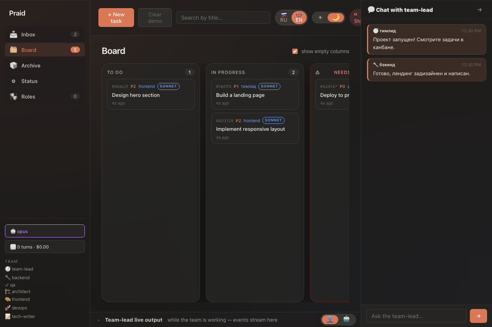

# devboard

> AI-команда разработки в твоём канбане.

Семь ролей-ботов — **тимлид**, **бэкенд**, **QA**, **архитектор**, **frontend**, **DevOps**, **техписатель** — делят один локальный канбан и пишут настоящий код, пока ты смотришь на доску. Ты ставишь задачу; команда декомпозирует её, пишет код, гоняет тесты и возвращает результат тебе на ревью. Опасные операции (`git push`, `ssh` и т.п.) проходят через approval-gate — без твоего явного подтверждения агенты их не выполняют.



## Быстрый старт

```bash
git clone https://github.com/rdm9x/devboard.git
cd devboard
cp .env.example .env
# пропиши ANTHROPIC_API_KEY в .env
docker compose up
# открой http://localhost:4999
```

Работает на Windows / macOS / Linux. Полная документация — установка без Docker, роли, мультикомандный режим v2.0, конфигурация — в [README.md](README.md) (EN).

[MIT](LICENSE) © 2026 Dmitry Rudich.
